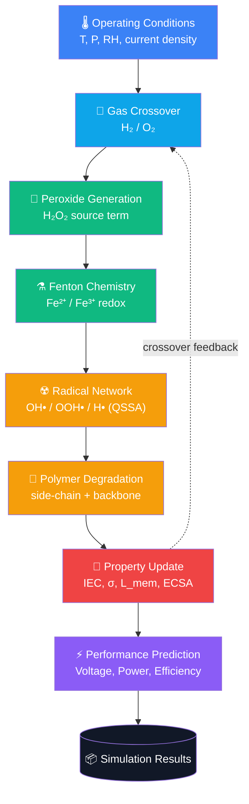
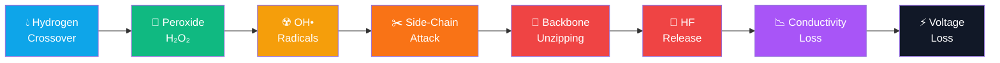
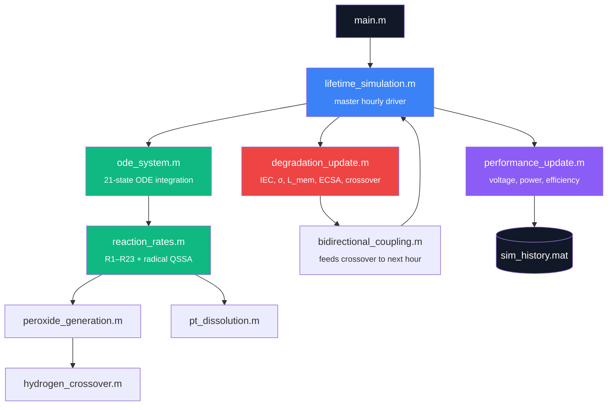

<div align="center">

<br/>

# ⚡ PEMFC Degradation Simulator

### Physics-Based PEMFC Degradation Simulation Framework

**A 21-state, mechanistic MATLAB framework coupling Fenton radical chemistry, membrane attack, and platinum dissolution into a closed-loop degradation and performance prediction pipeline.**

<br/>


<br/>

</div>

---

<div align="center">

## 🧭 Navigate

<table>
<tr>
<td align="center" width="140"><a href="#-1-project-overview"><b>🏠<br/>Overview</b></a></td>
<td align="center" width="140"><a href="#-2-key-features"><b>⚡<br/>Features</b></a></td>
<td align="center" width="140"><a href="#-3-project-statistics"><b>📈<br/>Statistics</b></a></td>
<td align="center" width="140"><a href="#-4-simulation-workflow"><b>🔄<br/>Workflow</b></a></td>
<td align="center" width="140"><a href="#-6-physics--mathematical-model"><b>🧪<br/>Physics</b></a></td>
</tr>
<tr>
<td align="center" width="140"><a href="#-5-repository-structure"><b>📂<br/>Repository</b></a></td>
<td align="center" width="140"><a href="#-10-installation"><b>🚀<br/>Quick Start</b></a></td>
<td align="center" width="140"><a href="#-13-results-gallery"><b>📊<br/>Results</b></a></td>
<td align="center" width="140"><a href="#-15-validation"><b>✅<br/>Validation</b></a></td>
<td align="center" width="140"><a href="#-18-references"><b>📚<br/>References</b></a></td>
</tr>
</table>

</div>

---

## 🏠 1. Project Overview

Membrane chemical degradation is one of the primary lifetime-limiting failure modes in Proton Exchange Membrane Fuel Cells (PEMFCs). Hydrogen and oxygen crossing over the membrane generate hydrogen peroxide; trace iron contamination catalyzes the **Fenton reaction**, producing hydroxyl and hydroperoxyl radicals that attack the membrane's sulfonic-acid side chains and perfluorinated backbone. This thins the membrane, increases crossover further, and accelerates its own degradation — a self-reinforcing feedback loop that is difficult to model because it spans **nanosecond radical chemistry** and **thousand-hour lifetime timescales** simultaneously.

**Why this project exists:** most open PEMFC degradation tooling either treats chemistry and macroscopic property loss as disconnected, or stays at a conceptual level without a runnable, fully wired implementation. This framework closes that gap with a single, mechanistically transparent, closed-loop MATLAB/Octave implementation — every parameter traceable to either a literature source or an explicitly flagged engineering assumption.

<table>
<tr>
<td width="33%" valign="top">

**🎯 Main Objectives**
- Mechanistically transparent degradation kinetics
- Closed feedback loop, not isolated mechanisms
- Every parameter traceable in source

</td>
<td width="33%" valign="top">

**🔬 Main Contributions**
- 21-state coupled ODE chemistry model
- QSSA radical solver for numerical tractability
- Mechanism isolation & sensitivity tooling

</td>
<td width="33%" valign="top">

**📌 Scope**
- Chemical degradation (not mechanical/thermal)
- Zero-dimensional, lumped membrane model
- Offline batch simulation, not real-time

</td>
</tr>
</table>

> 📋 **Before using outputs quantitatively:** read [`VALIDATION_REPORT.md`](VALIDATION_REPORT.md). It documents every bug found and fixed during development, and the current verification status of every file in this repository.

---

## ⚡ 2. Key Features

| | | |
|---|---|---|
| ✅ Physics-based 21-state chemistry ODE | ✅ Dynamic H₂/O₂ crossover | ✅ Peroxide (H₂O₂) generation |
| ✅ Fenton chemistry (Fe²⁺/Fe³⁺ cycling) | ✅ Quasi-steady-state radical network | ✅ Membrane side-chain attack |
| ✅ Backbone unzipping (HF, CO₂ release) | ✅ Pt dissolution & redeposition | ✅ ECSA degradation |
| ✅ Membrane conductivity & thickness loss | ✅ Bidirectional feedback coupling | ✅ Cell voltage/power prediction |
| ✅ Hourly-resolution lifetime driver | ✅ Mechanism on/off switches | ✅ Parameter sensitivity sweeps |
| ✅ Mechanism ranking / isolation | ✅ Modular file-per-mechanism design | ✅ Documented module contract |

---

## 📈 3. Project Statistics

<table>
<tr>
<td align="center" width="16.6%">

**23**
Reactions
`R1 – R23`

</td>
<td align="center" width="16.6%">

**21**
Coupled States
Chemistry ODE

</td>
<td align="center" width="16.6%">

**5**
Coupled Mechanisms
Chemical + Pt

</td>
<td align="center" width="16.6%">

**120 h**
Demo Run
`5000 h` target

</td>
<td align="center" width="16.6%">

**MATLAB**
No extra toolboxes

</td>
</tr>
</table>

<table>
<tr>
<td align="center" width="25%">🧮<br/><b>ODE Solver</b><br/><sub><code>ode15s</code> → <code>ode45</code> fallback</sub></td>
<td align="center" width="25%">📉<br/><b>Sensitivity Analysis</b><br/><sub>One-at-a-time parameter sweeps</sub></td>
<td align="center" width="25%">🏆<br/><b>Mechanism Ranking</b><br/><sub>Isolate & compare pathways</sub></td>
<td align="center" width="25%">🗂️<br/><b>29 Source Files</b><br/><sub>Modular, single-responsibility</sub></td>
</tr>
</table>

---

## 🔄 4. Simulation Workflow



---

## 📂 5. Repository Structure

```text
project/
│
├── 🚪 main.m                        Single entry point — run this
│
├── ⚙️  Configuration
│   ├── parameters.m                 Physical constants & initial conditions
│   ├── kinetic_parameters.m         Arrhenius rate constants (R1–R23)
│   ├── operating_conditions.m       T, P, RH, current density, load profile
│   └── mechanism_switch.m           Per-mechanism on/off toggles
│
├── ⚗️  Chemistry
│   ├── reaction_rates.m             R1–R23 rates + radical QSSA solve
│   ├── peroxide_generation.m        Crossover → H₂O₂ source term
│   ├── hydrogen_crossover.m         Dynamic H₂/O₂ crossover flux
│   ├── fenton_chemistry.m           Radical propagation/termination (R8–R13)
│   ├── membrane_attack.m            Side-chain cleavage (R14–R16)
│   ├── polymer_unzipping.m          Backbone unzipping (R17–R23)
│   └── pt_dissolution.m             Pt dissolution/redeposition, ECSA
│
├── 🔗 Coupled Pipeline
│   ├── ode_system.m                 21-state fast-chemistry ODE (dydt)
│   ├── degradation_update.m         Sole authority: IEC, σ, L_mem, ECSA, crossover
│   ├── bidirectional_coupling.m     Feeds crossover back into operating conditions
│   ├── performance_update.m         Voltage, power, efficiency
│   ├── membrane_properties.m        Diagnostics: water uptake, porosity, mechanics
│   └── lifetime_simulation.m        Master hourly driver
│
├── 🔬 Analysis (standalone, own local ODE implementations)
│   ├── species_evolution.m          Species time-series plotting
│   ├── time_scale_analysis.m        Per-reaction contribution over time
│   ├── mechanism_ranking.m          Mechanism isolation / tornado ranking
│   ├── parameter_sensitivity.m      One-at-a-time parameter sweeps
│   ├── interaction_analysis.m       Cause–effect interaction graph
│   ├── heatmap_analysis.m           Sensitivity heatmap
│   ├── generate_presentation_data.m Exports the core diagnostic figure set
│   └── get_audited_parameters.m     Self-contained CODATA/literature audit
│
├── 🖼️  figures/                      Architecture & overview diagrams
├── 📄 report/                       LaTeX technical report + figures
├── 🗄️  legacy_unverified_outputs/    Pre-audit artifacts, kept for reference
├── 📋 VALIDATION_REPORT.md          Full bug list, fixes, verification status
└── 📘 README.md                     You are here
```

<details>
<summary><b>📖 Click to expand: what each layer of the pipeline is responsible for</b></summary>
<br/>

| Layer | Files | Responsibility |
|---|---|---|
| **Configuration** | `parameters.m`, `kinetic_parameters.m`, `operating_conditions.m`, `mechanism_switch.m` | Everything the model needs to know before it runs a single timestep |
| **Chemistry** | `reaction_rates.m` + mechanism files | Turns concentrations + rate constants into reaction rates, per-mechanism |
| **Coupled Pipeline** | `ode_system.m` → `degradation_update.m` → `bidirectional_coupling.m` → `performance_update.m` | The verified, wired-together master loop, driven by `lifetime_simulation.m` |
| **Analysis** | `species_evolution.m` and siblings | Standalone diagnostics with their own simplified local ODEs — useful, but **not** re-verified against the master pipeline (see [§15 Validation](#-15-validation)) |

</details>

---

## 🏗️ 6. Physics & Mathematical Model

<details open>
<summary><b>⚡ Arrhenius Kinetics</b></summary>
<br/>

All 23 reaction rate constants follow standard Arrhenius temperature dependence:

$$k_i = A_i \exp\left(-\frac{E_{a,i}}{RT}\right)$$

where $A_i$ and $E_{a,i}$ are defined per-reaction in `kinetic_parameters.m`, sourced from Fruhwirt et al. (2020) for the Fenton/radical/iron-redox network (R1–R23).

</details>

<details>
<summary><b>⚗️ Fenton Chemistry</b></summary>
<br/>

Iron catalyzes peroxide decomposition into hydroxyl radicals, the primary agents of membrane attack:

$$\text{Fe}^{2+} + \text{H}_2\text{O}_2 \rightarrow \text{Fe}^{3+} + \text{OH}^{\bullet} + \text{OH}^-$$

Fe³⁺ regenerates back to Fe²⁺ via a slower secondary pathway, sustaining (but rate-limiting) the radical cycle.

</details>

<details>
<summary><b>☢️ Radical Network (Quasi-Steady-State Approximation)</b></summary>
<br/>

OH•, OOH•, and H• have sub-microsecond lifetimes against an hour-scale simulation — a stiffness ratio too large for direct ODE integration. They are instead solved algebraically at every rate evaluation:

$$\frac{d[\text{OH}^\bullet]}{dt} \approx 0 \quad\Rightarrow\quad [\text{OH}^\bullet]_{ss} = \frac{2c}{b + \sqrt{b^2 + 4ac}}$$

The numerically stable "Citardauq" form is used deliberately — the naive quadratic formula suffers catastrophic cancellation for this system's parameter regime (see `VALIDATION_REPORT.md`, bug #4).

</details>

<details>
<summary><b>💨 Hydrogen Crossover</b></summary>
<br/>

Fickian permeation through the membrane:

$$J_{H_2} = \frac{P_{H_2} \cdot \Delta P}{L_{mem}}$$

with permeability $P_{H_2}$ itself Arrhenius-dependent on temperature. Crossover increases as `L_mem` (membrane thickness) decreases — the mechanism that closes the degradation feedback loop.

</details>

<details>
<summary><b>🧵 Membrane Conductivity Model</b></summary>
<br/>

Conductivity follows a percolation-type power law in remaining ion-exchange capacity (IEC):

$$\sigma = \sigma_0 \left(\frac{IEC}{IEC_0}\right)^{1/\tau}$$

where $\tau$ is the percolation exponent (functional form after Stauffer & Aharony, 1994).

</details>

<details>
<summary><b>🔩 Platinum Dissolution</b></summary>
<br/>

Potential-driven Butler–Volmer-type dissolution/redeposition kinetics govern electrochemically active surface area (ECSA) loss, following the functional form of Darling & Meyers (2003) and Rinaldo et al. (2011).

</details>

<details>
<summary><b>🔋 Voltage Model</b></summary>
<br/>

$$V = V_{OCV} - \eta_{act} - \eta_{ohmic}$$

Activation loss uses a lumped Butler–Volmer expression corrected for catalyst-layer roughness factor (ECSA × Pt areal loading); ohmic loss follows directly from membrane conductivity and thickness.

</details>

---

## 🧬 7. Mechanism Flow



---

## 🏛️ 8. Software Architecture



---

## 🧩 9. Model Components

| Module | Description | Physics | Inputs | Outputs |
|---|---|---|---|---|
| `hydrogen_crossover.m` | Gas transport through membrane | Fickian permeation, Arrhenius permeability | `L_mem`, T, ΔP | `J_H2`, `J_O2` |
| `peroxide_generation.m` | Crossover → H₂O₂ source | Electrochemical/chemical crossover reaction | Crossover flux | H₂O₂ generation rate |
| `reaction_rates.m` / `fenton_chemistry.m` | Radical generation & cycling | Fenton redox, QSSA radical balance | Species, T, kinetics | OH•, OOH•, H•, Fe²⁺/Fe³⁺ |
| `membrane_attack.m` | Side-chain cleavage | Radical attack on –SO₃H groups | R14–R16 rates | IEC loss rate |
| `polymer_unzipping.m` | Backbone degradation | Sequential –CF₂– unzipping | R17–R23 rates | HF, CO₂, chain-length pools |
| `pt_dissolution.m` | Catalyst degradation | Potential-driven Pt²⁺ dissolution/redeposition | Potential, T, Pt state | Pt, Pt²⁺, ECSA |
| `degradation_update.m` | Macro property evolution | Aggregates chemistry into membrane state | Species, `dt` | IEC, σ, `L_mem`, crossover, ECSA |
| `bidirectional_coupling.m` | Closes the feedback loop | Updated crossover → next macro-step | `props` | Updated operating conditions |
| `performance_update.m` | Cell-level output | Butler–Volmer + ohmic loss | `props`, species | Voltage, power, efficiency |

---

## 📊 10. Simulation Outputs

<table>
<tr>
<td width="25%" align="center">⚡<br/><b>Voltage</b><br/><sub>Cell voltage under load, declining over time</sub></td>
<td width="25%" align="center">🧪<br/><b>HF</b><br/><sub>Fluoride release — standard degradation marker</sub></td>
<td width="25%" align="center">☁️<br/><b>CO₂</b><br/><sub>Released as the backbone unzips</sub></td>
<td width="25%" align="center">🧲<br/><b>Fe²⁺ / Fe³⁺</b><br/><sub>Iron redox couple driving Fenton chemistry</sub></td>
</tr>
<tr>
<td width="25%" align="center">☢️<br/><b>OH• / OOH• / H•</b><br/><sub>Reactive radicals (QSSA), direct membrane attackers</sub></td>
<td width="25%" align="center">🔩<br/><b>Pt / Pt²⁺</b><br/><sub>Metallic and dissolved platinum states</sub></td>
<td width="25%" align="center">📐<br/><b>ECSA</b><br/><sub>Active catalyst area, lost with Pt dissolution</sub></td>
<td width="25%" align="center">🧵<br/><b>Conductivity (σ)</b><br/><sub>Proton conductivity, falls with IEC loss</sub></td>
</tr>
<tr>
<td width="25%" align="center">📏<br/><b>Thickness (L_mem)</b><br/><sub>Declines with cumulative mass loss</sub></td>
<td width="25%" align="center">💨<br/><b>H₂ Crossover</b><br/><sub>Increases as the membrane thins</sub></td>
<td width="25%" align="center">🧴<br/><b>Peroxide (H₂O₂)</b><br/><sub>Fenton reaction's oxidant source</sub></td>
<td width="25%" align="center">🔋<br/><b>Power / Efficiency</b><br/><sub>Derived from voltage and current density</sub></td>
</tr>
</table>

---

## 🧫 11. Mechanisms Included

| Mechanism | Description | Status | Reference |
|---|---|:---:|---|
| Hydrogen/oxygen crossover | Gas permeation coupled to membrane state | ✅ | Arrhenius permeability (literature form) |
| Peroxide generation | H₂O₂ formation from crossover flux | ✅ | Calibrated to literature micromolar range |
| Fenton chemistry | Fe²⁺/Fe³⁺-catalyzed radical generation | ✅ | Fruhwirt et al. (2020) |
| Radical network (QSSA) | Algebraic OH•/OOH•/H• quasi-steady-state | ✅ | Turanyi & Tomlin (2014) |
| Side-chain attack | Sulfonic-acid group cleavage, IEC loss | ✅ | Fruhwirt et al. (2020) |
| Backbone unzipping | HF/CO₂-releasing chain degradation | ✅ | Fruhwirt et al. (2020) |
| Pt dissolution/redeposition | Potential-driven catalyst loss, ECSA decline | ✅ | Darling & Meyers (2003); Rinaldo et al. (2011) |
| Conductivity/thickness degradation | Percolation-based property loss | ✅ | Stauffer & Aharony (1994) (functional form) |
| Performance degradation | Voltage/power decline from combined losses | ✅ | Neyerlin et al. (2006) (ORR kinetics range) |

---

## 🧪 12. Interactive Deep-Dives

<details>
<summary><b>▶ Species Evolution</b></summary>
<br/>

`species_evolution.m` runs a standalone chemical degradation simulation and plots the time evolution of requested species. It uses its own self-contained local ODE implementation (not the master `ode_system.m` pipeline) and has not been independently re-verified against it — see [§15 Validation](#-15-validation).

</details>

<details>
<summary><b>▶ Mechanism Isolation</b></summary>
<br/>

`mechanism_ranking.m` disables each of the 7 major mechanisms one at a time, re-runs the simulation, and measures the impact on key metrics (lifetime, HF, fluoride evolution rate, side-chain concentration, IEC, conductivity, Pt loss). It uses MATLAB's `table` type and could not be executed in the GNU Octave test environment.

</details>

<details>
<summary><b>▶ Sensitivity Analysis</b></summary>
<br/>

`parameter_sensitivity.m` performs one-at-a-time (OAT) sweeps over temperature, Fe concentration, H₂O₂ concentration, Pt loading, Pt radius, Pt dissolution constant, conductivity coefficient, membrane thickness, and initial crossover. `heatmap_analysis.m` consumes its output to render a sensitivity heatmap.

</details>

<details>
<summary><b>▶ Lifetime Simulation</b></summary>
<br/>

`lifetime_simulation.m` is the master driver: for every simulated hour it integrates `ode_system.m`, calls `degradation_update.m` (the sole authority for macroscopic property updates), applies `bidirectional_coupling.m` to close the feedback loop, and calls `performance_update.m`. A 120-hour demonstration run is included; 5000 h is the project's target duration (see the runtime note in [§10 Installation](#-10-installation)).

</details>

<details>
<summary><b>▶ Validation</b></summary>
<br/>

Every bug identified during development, every fix applied, and the current verification status of every file is documented in [`VALIDATION_REPORT.md`](VALIDATION_REPORT.md). See [§15](#-15-validation) below for a summary.

</details>

---

## 🔬 13. Simulation Pipeline


---

## ✅ 14. Validation

<table>
<tr>
<td width="25%" valign="top">

**📚 Literature Validation**

R1–R23 Fenton/radical/iron-redox rate constants taken directly from Fruhwirt et al. (2020), unit-checked (L·mol⁻¹·s⁻¹ → m³·mol⁻¹·s⁻¹).

</td>
<td width="25%" valign="top">

**🔍 Parameter Verification**

Every parameter in `parameters.m` / `kinetic_parameters.m` is flagged as literature-sourced or `TODO/ASSUMPTION` with rationale in-code.

</td>
<td width="25%" valign="top">

**📉 Sensitivity Analysis**

OAT sweeps over temperature, Fe concentration, H₂O₂, Pt loading/radius, and membrane/coupling parameters via `parameter_sensitivity.m`.

</td>
<td width="25%" valign="top">

**🧩 Mechanism Isolation**

`mechanism_switch.m` and `mechanism_ranking.m` disable individual pathways to quantify each one's contribution to overall degradation.

</td>
</tr>
</table>

> ⚠️ **Known limitation:** the standalone analysis scripts (`species_evolution.m`, `time_scale_analysis.m`, `mechanism_ranking.m`, `parameter_sensitivity.m`, `interaction_analysis.m`, `heatmap_analysis.m`) use their own local, simplified ODE implementations, separate from the master pipeline, and were **not** independently re-verified in this engagement. `mechanism_ranking.m` (`table`) and `interaction_analysis.m` (`digraph`) additionally require MATLAB and could not run in the GNU Octave test environment used for validation.

Full bug-by-bug detail: [`VALIDATION_REPORT.md`](VALIDATION_REPORT.md).

---

---

## 🚀 15. Installation

**Requirements**

| Requirement | Notes |
|---|---|
| MATLAB R2018b+ | Recommended — needed for `ode15s`, `digraph`, `table` |
| Toolboxes | None beyond base MATLAB required for the master pipeline |

```bash
git clone <repository-url>
cd project
```

Then, from MATLAB with the project directory as your working directory:

```matlab
main
```

> **⏱️ Runtime note:** the reaction network is numerically stiff. `lifetime_simulation.m` tries `ode15s` first and falls back to `ode45`. A full 5000-hour run exceeds typical interactive compute budgets — a 120-hour demonstration dataset is included.

---

## ⚡ Quick Start

```matlab
% Run the default 120-hour demonstration simulation
main

% Or call the driver directly for a custom duration (hours)
history = lifetime_simulation(500);
save('sim_history.mat', 'history');
```

Edit `simulation_hours` in `main.m` to change run length (5000 h is the project's target duration). Secondary scripts such as `species_evolution.m`, `parameter_sensitivity.m`, and `mechanism_ranking.m` can be run independently once you're comfortable with the base pipeline.

---

## 🔭 Scientific Background

A PEMFC generates electricity by oxidizing hydrogen at the anode and reducing oxygen at the cathode, with protons transported across a perfluorosulfonic acid (PFSA) membrane such as Nafion. Chemical degradation — as distinct from mechanical or thermal degradation — is driven primarily by peroxide radical attack: crossed-over gases form H₂O₂ at trace metal-ion sites, iron contamination catalyzes the Fenton reaction into hydroxyl/hydroperoxyl radicals, and those radicals attack side chains and backbone, releasing fluoride and thinning the membrane. Thinning increases crossover, closing a self-accelerating loop. In parallel, the platinum catalyst degrades via potential-driven dissolution/redeposition, independently reducing ECSA and raising activation losses.

---

## 📚 16. References

1. Fruhwirt, P., Kregar, A., Törring, J. T., Katrašnik, T., Gescheidt, G. "Holistic approach to chemical degradation of Nafion membranes in fuel cells: modelling and predictions." *Physical Chemistry Chemical Physics*, 22 (2020) 5647–5666.
2. Darling, R. M., Meyers, J. P. "Kinetic Model of Platinum Dissolution in PEMFCs." *Journal of the Electrochemical Society*, 150 (2003).
3. Rinaldo, S. G., Stumper, J., Eikerling, M. "Physical Theory of Platinum Nanoparticle Dissolution in Polymer Electrolyte Fuel Cells." *Journal of Physical Chemistry C*, 2011.
4. Stauffer, D., Aharony, A. *Introduction to Percolation Theory*, 2nd ed., Taylor & Francis, 1994.
5. Neyerlin, K. C., Gu, W., Jorne, J., Gasteiger, H. A. "Study of the Exchange Current Density for the Hydrogen Oxidation and Evolution Reactions." *Journal of the Electrochemical Society*, 2006.
6. Gasteiger, H. A., Kocha, S. S., Sompalli, B., Wagner, F. T. "Activity benchmarks and requirements for Pt, Pt-alloy, and non-Pt oxygen reduction catalysts for PEMFCs." *Applied Catalysis B: Environmental*, 2005.
7. Ohma, A. et al. "Membrane Degradation Mechanism during Open-Circuit Voltage Hold Test." *ECS Transactions*, 41 (2011) 775.
8. Turanyi, T., Tomlin, A. S. *Analysis of Kinetic Reaction Mechanisms*. Springer, 2014.

Full inventory of literature-sourced vs. assumed parameters: `VALIDATION_REPORT.md` §4.

---

## 📌 Citation

```bibtex
@software{pemfc_degradation_simulator,
  title  = {PEMFC Chemical Degradation Simulator},
  author = {{Project Contributors}},
  year   = {2026},
  note   = {Physics-based MATLAB framework for PEMFC chemical membrane degradation},
  url    = {<repository-url>}
}
```

---

## 🤝 Contributing

Contributions are welcome, particularly around independent re-verification of the secondary analysis scripts (see [§15 Validation](#-15-validation)) and experimental validation of assumed parameters.

1. Fork the repository and create a feature branch.
2. Keep the module contract intact — `degradation_update.m` remains the sole authority for macroscopic property updates; `ode_system.m` handles fast chemistry only.
3. Flag any new parameter as literature-sourced (with citation) or `TODO/ASSUMPTION` (with rationale), following the existing convention.
4. Update `VALIDATION_REPORT.md` if you fix a bug or change a file's verification status.
5. Open a pull request describing the change and its physical/numerical justification.

---

## 📄 License

Released under the [MIT License](LICENSE).

---

<div align="center">

## 📬 Contact

For questions, issues, or collaboration inquiries, please open an issue on this repository.

<br/>

**⭐ If this framework is useful to your research, consider starring the repository.**

</div>
