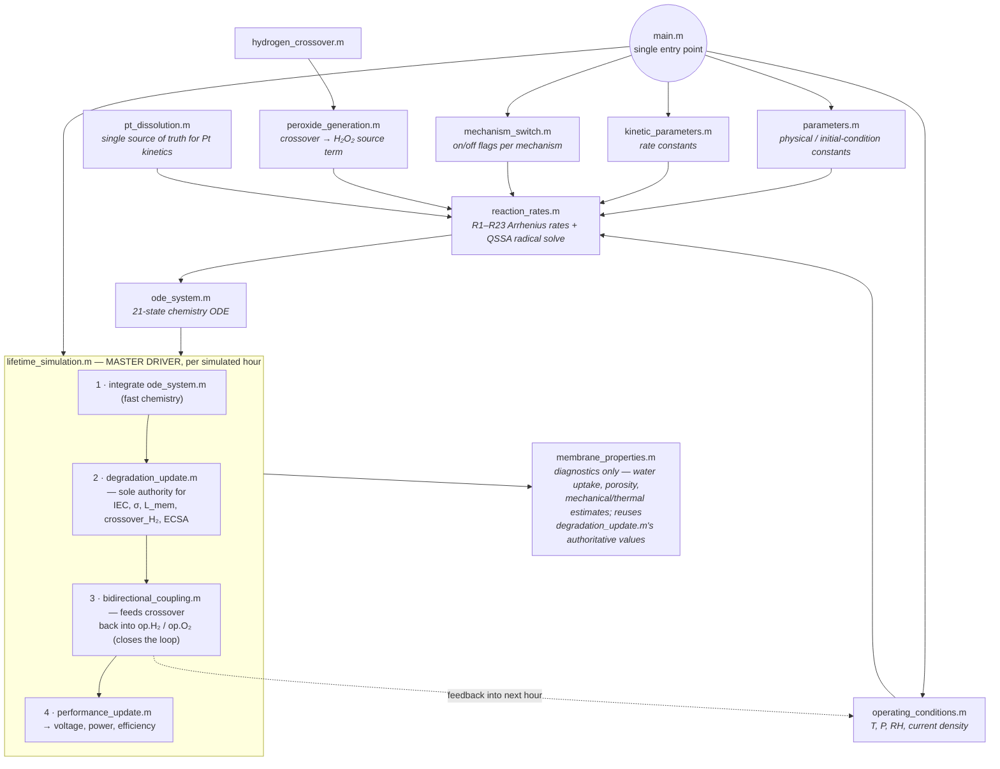

# ⚡ PEMFC Membrane Degradation Simulator

<p align="left">
  
  
  
</p>

A physics-based, modular MATLAB simulator for **PEM fuel cell membrane chemical degradation**, coupling five mechanisms into a closed feedback loop:

> **H₂/O₂ crossover** → peroxide generation → **Fenton chemistry** → Pt dissolution/redeposition → membrane side-chain attack → backbone unzipping → HF release → **IEC / conductivity / thickness loss** → increased H₂ crossover → *(loop closes)*

> [!IMPORTANT]
> **Read [`VALIDATION_REPORT.md`](./VALIDATION_REPORT.md) before using simulation outputs for anything beyond qualitative trend illustration.** It documents every bug found and fixed, every parameter that is a literature value vs. an engineering assumption, and the current verification status of every file.

---

## 🚀 Quick start

```matlab
main
```

Runs a **120-hour** demonstration simulation and saves `sim_history.mat`.
Edit `simulation_hours` in `main.m` to run longer (e.g. `5000` for the full target lifetime — see the [runtime note](#-runtime-note-read-this-first) below).

---

## 🧭 Execution pipeline



---

## ✅ Verification status

<table>
<tr><th>Status</th><th>Files</th></tr>
<tr>
<td valign="top">🟢<br/><b>Fully debugged, tested & verified</b><br/><sub>in this engagement — see <code>VALIDATION_REPORT.md</code> for the full bug list</sub></td>
<td valign="top">

`parameters.m` · `kinetic_parameters.m` · `reaction_rates.m` · `peroxide_generation.m` · `hydrogen_crossover.m` · `pt_dissolution.m` · `ode_system.m` · `degradation_update.m` · `bidirectional_coupling.m` · `performance_update.m` · `membrane_properties.m` · `lifetime_simulation.m` · `main.m`

</td>
</tr>
<tr>
<td valign="top">🟡<br/><b>Present but NOT independently re-verified</b><br/><sub>self-contained, simplified local ODE implementations, separate from the master pipeline — a design already present before this engagement</sub></td>
<td valign="top">

`species_evolution.m` · `time_scale_analysis.m` · `mechanism_ranking.m` · `parameter_sensitivity.m` · `interaction_analysis.m` · `heatmap_analysis.m` · `generate_presentation_data.m` · `get_audited_parameters.m`

> ⚠️ `interaction_analysis.m` (`digraph`/`plot`) and `mechanism_ranking.m` (`table`) use MATLAB objects
> See `VALIDATION_REPORT.md`, **Section 5**, for specifics and recommended fixes.

</td>
</tr>
</table>

---

## ⏱️ Runtime note (read this first)

The reaction network (Fenton radical chemistry + backbone unzipping) is **numerically stiff**: hydroxyl-radical timescales are nanosecond-scale while the simulation spans thousands of hours. `reaction_rates.m` uses a **quasi-steady-state approximation (QSSA)** for OH/OOH/H to make this tractable — see code comments there for the numerical-stability rationale.

<details>
<summary><b>Solver behavior: <code>ode15s</code> vs <code>ode45</code></b> (click to expand)</summary>

<br/>

`lifetime_simulation.m` tries `ode15s` (fast, MATLAB's variable-order BDF solver) first and falls back to `ode45` if it fails to converge.

| Environment | Result |
|---|---|
| **MATLAB proper** | `ode15s` is **expected to succeed and should be substantially faster** — *not verified against a real MATLAB license in this engagement; check this yourself* |

A full **5000 h** run took longer than the compute budget available in this engagement. A **120 h** demonstration dataset is included instead:

- `checkpoint.mat`
- `history_export.csv`
- `figures/`

See `VALIDATION_REPORT.md` for the observed 120 h trends and guidance on extrapolating/extending the run.

</details>

---

## 📦 Requirements

| | |
|---|---|
| **MATLAB** | R2018b+ recommended (for `ode15s`, `digraph`, `table`) |
| **Toolboxes** | None required for the master pipeline |

---

## 📚 Literature basis

- **Fenton / radical / iron-redox rate constants** (R1–R23 pre-exponential factors and activation energies in `kinetic_parameters.m`, Section 1) are taken from:
  > Frühwirt, P.; Kregar, A.; Törring, J.T.; Katrašnik, T.; Gescheidt, G. *"Holistic approach to chemical degradation of Nafion membranes in fuel cells: modelling and predictions."* **Physical Chemistry Chemical Physics** 22 (2020) 5647–5666.

  Verified for correct **L·mol⁻¹·s⁻¹ → m³·mol⁻¹·s⁻¹** unit conversion (cross-checked against the self-contained audit in `get_audited_parameters.m`).

- **Pt dissolution** functional form follows **Darling & Meyers (2003)** and **Rinaldo et al. (2011)**.

- Specific rate constants for **Pt, coupling/percolation, crossover, and performance parameters** are engineering order-of-magnitude estimates, *not* individually fit to a published dataset for this project. Every such parameter is flagged `TODO/ASSUMPTION` with its rationale directly in the source (`parameters.m`, `kinetic_parameters.m`).

> 📖 See `VALIDATION_REPORT.md` and the accompanying LaTeX report for the complete reference list and an explicit inventory of literature-sourced vs. assumed parameters.

---

<p align="center"><sub>Built for spatially-resolved PEMFC durability research · MATLAB / GNU Octave compatible</sub></p>
